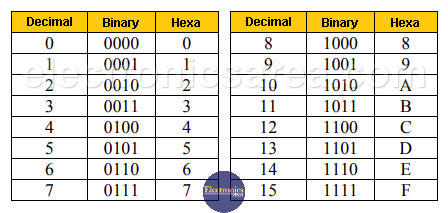

# Number systems


To convert a binary number to a decimal number, follow these steps:

1. **Write Down the Binary Number**: Note the binary number you want to convert. For example, let's use `1011`.

2. **Assign Powers of 2**: Starting from the right (least significant bit), assign powers of 2 to each bit. The rightmost bit is `2^0`, the next one is `2^1`, then `2^2`, and so on.
   ```
   1  0  1  1
   2^3  2^2  2^1  2^0
   ```

3. **Multiply Each Bit by Its Corresponding Power of 2**:
   - `1 * 2^3 = 1 * 8 = 8`
   - `0 * 2^2 = 0 * 4 = 0`
   - `1 * 2^1 = 1 * 2 = 2`
   - `1 * 2^0 = 1 * 1 = 1`

4. **Sum the Results**: Add up all the results from the previous step.
   ```
   8 + 0 + 2 + 1 = 11
   ```

So, the binary number `1011` converts to the decimal number `11`.


To convert a number from any base to base 10 (decimal), you can use the following method:

1. **Write Down the Number**: Write down the number you want to convert. For example, let's say we have the number `1011` in base 2 (binary).

2. **Assign Powers of the Base**: Starting from the right (least significant digit), assign powers of the base to each digit. In our example with base 2:
   ```
   1  0  1  1
   2^3  2^2  2^1  2^0
   ```

3. **Multiply Each Digit by Its Corresponding Power of the Base**: 
   - For base 2:
     - `1 * 2^3 = 1 * 8 = 8`
     - `0 * 2^2 = 0 * 4 = 0`
     - `1 * 2^1 = 1 * 2 = 2`
     - `1 * 2^0 = 1 * 1 = 1`
   
4. **Sum the Results**: Add up all the results from the previous step.
   ```
   8 + 0 + 2 + 1 = 11
   ```

So, the binary number `1011` converts to the decimal number `11`.


### General Formula
For any base `b`, the number `d_n d_{n-1} ... d_1 d_0` can be converted to base 10 using the formula:
$$
d_n \times b^n + d_{n-1} \times b^{n-1} + ... + d_1 \times b^1 + d_0 \times b^0
$$

### Example for Base 8 (Octal)
Let's convert the octal number `175` to decimal:
   - `1 * 8^2 = 1 * 64 = 64`
   - `7 * 8^1 = 7 * 8 = 56`
   - `5 * 8^0 = 5 * 1 = 5`
   
   Sum: `64 + 56 + 5 = 125`

### Example for Base 16 (Hexadecimal)
Let's convert the hexadecimal number `1A3` to decimal (note: `A` in hex is `10` in decimal):
   - `1 * 16^2 = 1 * 256 = 256`
   - `A (10) * 16^1 = 10 * 16 = 160`
   - `3 * 16^0 = 3 * 1 = 3`
   
   Sum: `256 + 160 + 3 = 419`


***If a number starts with `0b`, it signifies that the number is in binary (base 2). If it starts with `0x`, it indicates that the number is in hexadecimal (base 16).***


# Assembly Syntax

Instructions have 4 fields separated by space or tabs :

> Label     Opcode      Operand;    comment

**label :**[optional] used to find position of the current instruction in memory.  
**Opcode :** Specifies processor operation to preform .  
**Operand :** Specifies source/destination of data to be processed by opcode.
**Comment :**[optional]used to explain code meaning


example : 
> store_routine     STR     R0,[R1];    store the value of R0 into R1
>
>   [Label]       [Opcode] [Operand]           [Comment]

