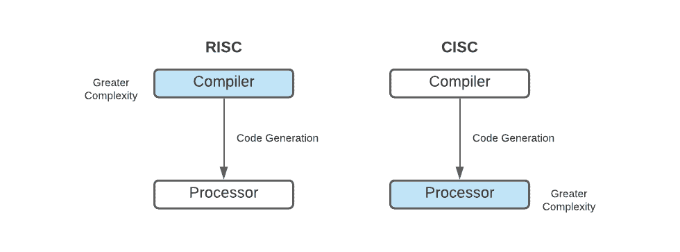
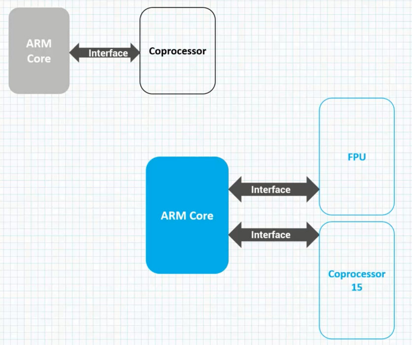

# The RISC Design Philosophy
**RISC :** Reduced instruction set computer. [*ARM use*]

**CISC :** Complex instruction set computer. [*Intel use*]

&nbsp;&nbsp;&nbsp;The RISC design philosophy is aimed at simple but powerful instruction that execute within a single cycle
at hight clock speed. RISC focused on reducing complexing of the instruction. It's performed by hardware
because it's easier to provide greater flexibility and intelligence and software write it down in hardware.
As a result, greater demand is placed om the compiler.

&nbsp;&nbsp;&nbsp;RISC philosophy is implemented with 4 code in all design rules in mind :

*One*, there has to be reduced number of instruction and each instruction must be executed in a single cycle, to make sure every process a cycle executes on instruction

*Two*, instructions are executed in parallel using pipelines; This is important because in CISC, all times the process just runs while waiting for data or instruction to be ready for memory. 

*Three*, also RISC machines provide a larger number of general purpose registers in a register that can eat up the data or address registers first local stores that we do processing and we shall look out registers later.

*Four*, CISC architecture registers how dedicated purposes therefore do you know as flexible. Also in RISC architecture the process operates on data held in the registers. This is once of the other reasons RISC processes are capable of one instruction per cycle.

**Instruction :** Reduced number of instructions  
**Pipelines:** Instructions are executes in parallel by pipelines.  
**Registers:** Large general-purpose register ser.  
**Load-store:** Processor operates on data held in registers.

# ARM Design Philosophy
&nbsp;&nbsp;&nbsp;ARM processors are specifically designed to be small to reduce power consumption and extend battery operation, essentially fo applications such as mobile phones and other embedded devices. Because of this, thew ARM core is not pure RISK architecture.

&nbsp;&nbsp;&nbsp;In some sense, the strength of the ARM core is that it doesn't take the RISC concept too far. As we know in the devices we use today, The key isn't just the raw process or speed but the total effective system performers and power consumption.

&nbsp;&nbsp;&nbsp;ARM core competency lies in taking a RISC architecture, hight court density and part efficiency and putting it in process or court. 

&nbsp;&nbsp;&nbsp;Density simply means the amount of space that an executable program takes up in memory. High code density means the program takes less space. This is quite useful fo applications that have limited on board memory, such as mobile forms.

&nbsp;&nbsp;&nbsp; ***Fundamental difference between RISC and CISC :***  As you may know, in software development a compiler compiles the code and it generated binary file that is downloaded onto the processor. In RISC systems, due to iy's philosophy of simplifying instructions, greater complexity is placed on the compiler. The compiler has to take the simple instructions and understand the complex functions. Those instructions are supposed to perform and generate a simple binary file which will be downloaded on to the process source. Therefore complexity is placed on the compiler in the RISC system. In CISC architecture the compiler does minimal work, a greater complexity is placed on the processor in effect processor must be designed complex enough to understand the complex files generated by the compiler.

# Embedded Systems with ARM Processors

&nbsp;&nbsp;&nbsp;Let's look at typical embedded device based on the ARM core. An embedded device such as a microcontroller will basically make of an ARM core, some controllers, some peripherals and some Buses. These are the 4 main hardware components of an embedded device.

 

&nbsp;&nbsp;&nbsp;The ARM processor itself is made of core, this is the part of the processor that processes instructions and manipulates data plus some peripherals components such as memory management and cashes.

**AHB:** Advanced high performance bus.

# ARM Bus Technology and AMBA Bus Protocol

&nbsp;&nbsp;&nbsp;Basically there are 2 classes of devices connected to the bus : 

>               Bus Master ==> ARM processor core
>               Bus Slave ==> Peripheral

&nbsp;&nbsp;&nbsp;The `Bus Master` is offer a logical device capable of starting data transfer using another device and the `Slave` is only capable of responding to a transfer request from the `master`.

&nbsp;&nbsp;&nbsp;The bus has 2 architecture levels : The first level is known as the `Physical Level`, the second level is known as the `Protocol Level`.

&nbsp;&nbsp;&nbsp;The `Physical Level` deals with electrical properties of the bus and things like : Bus width, for example : 16-bit, 32-bit, 8-bit, .. . The `Bus protocol` dictates the rules, the `Bus master` and the `Bus slave` use to communicate.

&nbsp;&nbsp;&nbsp;`AMBA` stands for advanced microcontroller bus architecture and it's widely adopted on-chip architecture used for ARM processor. The very first `AMBA` bus where the ARM system bus and the ARM peripheral bus; Later on ARM, introduced the ARM high performance bus. Using the `AMBA` protocol designers can reuse the same design in multiple projects.

&nbsp;&nbsp;&nbsp;The `AHP` provides a higher throughput than `ASB` and `APB` because it's a kind of centralized multiplex  bus scheme. Rather than a bi-directional design like `ASB` and `APB` and because of this `AHB` buses can run at higher clock frequencies.

# Memory

&nbsp;&nbsp;&nbsp;An embedded system needs to have some form if memory to store and execute code.

#### Memory Hierarchy

&nbsp;&nbsp;&nbsp;This graph shows the memory trade off. The fastest memory is the `Cache` and physically located near the ARM processor core and the slowest memory is the `Secondary` which is set farther away from the ARM processor.

&nbsp;&nbsp;&nbsp;Generally speaking the closer memory is to the processor the more it cost and smaller it's capacity.

&nbsp;&nbsp;&nbsp;The `cache` is placed between the main memory and the core and it used to speed up data transfer between the processor and the main memory. For now you just have to remember that the `Cache` provides a general increase in performance and it comes with a loss of predictable execution time though. And this only become a problem when you are building a `Real time application`. Main memory is large, it's in `MB` mostly and sometimes even in `GB` depending on the application and the main memory is generally a separate chip from the ARM processor.

&nbsp;&nbsp;&nbsp;As we will see in loading and storing instructions are accessed in main memory unless the values are stored in the `Cache` for fast access. 

*`Secondary Memory` such as flash disk, hard disk, ot CH-Rom*

#### Memory Width

&nbsp;&nbsp;&nbsp;Number of bits memory returns in each access : E.g : 16-bit, 32-bit, 64-bit.  
The memory width has direct effect on overall performance. The ARM processor is capable of executing 3 instruction sets:  
The `ARM` instruction set which has 32-bits instructions.  
The `THUMB` instruction set which has 16-bit instructions.  
And the `THUMB2` instruction set which uses both 16-bit and 32-bit instructions.

#### Memory Type

&nbsp;&nbsp;&nbsp;`ROM` can't be reprogrammed.  
`Flash Rom` is a tyoe of `ROM` that can write to as well as read; But it's slow to write to. So it's not used for handling dynamic data, it's primarily used for holding the device firmware or storing long-term data that needs to be stored after the power is off.  
`Dynamic Random Access Memory(DRAM)` is the most commonly used type of `ROM` for devices. It has the lowest cost per `MB` compared to other types of `RAM`.  
`SRAM` stands for `Static Random Access Memory` is faster than `DRAM`. It's access time is shorter than the equivalent `DRAM` because `SRAM` doesn't require a pause between data access.  
`Synchronous Dynamic Random Access Memory(SDRAM)` is a subcategory of the `RAM` and it's capable of running at faster clock frequencies.  
`EEPROM` which stands for `Electrically Erasable Programmable Read Only Memory` is used for programme code storage. Most often for saving critical data.  

*Not all ARM chips have an on-chip `EEPROM`.*

&nbsp;&nbsp;&nbsp;Usually ARM has 4GB of directly accessible memory space. Now why is that?  
Remember Arm core are 32-bit cores and there are 32-bit cores because the internal registers are 32-bit , data path are 32-bit and ha interfaces are 32-bit.  
&nbsp;&nbsp;&nbsp;Then bit size allows the CPU to address a memory for an individual process. So an X-bit can handel 2X bytes of memory. Then higher the bit size, the higher the performance.  
Therefore a 32-bit can handle approximately 4GB of memory  
>  232 = 4294967296 bytes  = 4.2 GB  

&nbsp;&nbsp;&nbsp;The ARM memory space can be divided into 5 sections.  
The on-chip `peripherals` and `I/O registers` section which can occupy any of the empty areas. Here depending to hte specific silicone manufacturer.  
The `SRAM` section which is used for the data variables and the stack.  
the `EEPROM` section and the `Flash` section.  
The `SFP` section indicated up here; iy's for special function registers.

# Peripherals

&nbsp;&nbsp;&nbsp;So in this lesson we wil talk about the general architecture true behind interrupt peripherals of ARM processors.  
As you may know, embedded system that communicate with the outside world needs some form of peripherals,  
In a sense, the set of peripherals attached to the embedded device determines the uniqueness of that device. All ARM peripherals are `Memory-mapped` and this means that the programming interface is a set of memory addressed registers, and as we will see when we start coding, the address of the registers is an `offset` from a specific peripheral base address.  

&nbsp;&nbsp;&nbsp;The `Memory Controller` in diagram simply connects to different types of memory we talk about to the processor; For example,  
When  the power is turned on, the `Memory Controller`  maybe configured in hardware to allow certain memory devices just to be active. This memory devices allow the initialization code to be executed.  
Some memory devices must be set up in software though such as `DRAM`. We first have to set up the memory times and refresh rates using software before it can be accessed.

&nbsp;&nbsp;&nbsp;Now about the `Interrupt Controller`, it's basically determines which peripherals can be accessed the processor at certain times. There are 2 tyors of `Interrupt Controller` available in ARM :   
`The Standard Interrupt control` and `The Vectored Interrupt control`.

# Cache and  Tightly Couple Memory

&nbsp;&nbsp;&nbsp;In the next 3 lessons, we will look at some of the main extensions that can be placed next to the ARM core.  
These extensions improve performance, manage resources and provide additional functionality and designed to provide flexibility in handling specific applications.  
&nbsp;&nbsp;&nbsp;Each Arm family has different extensions available to it. There are 3 hardware ARM extensions to warp around the core.  
As we mentioned earlier, `Cache` is a block of first memory placed between core and main memory. It allows for more efficient retrievals from some memory types with a `cache` that the processor core can run for the most of the time without having to wait for data from slow external memory. Most ARM-based embedded systems are a single level cache internal to the processor.  
&nbsp;&nbsp;&nbsp;ARM comes in 2 forms of fast accessible memory. The first form is used the `von Neumann` architecture and this form which we are currently looking at, combines both data and instruction into single unified cache. The load and control and `AMBA` bus interface units simply helps connect the memory system to the `AMBA` bus, which connects to the main memory.  

&nbsp;&nbsp;&nbsp;The second form os fast accessible ,e,ory used by the ARM, is used the `Harvard` architecture. And this form has separate fast-accessible memory for data and instruction. And as you recall the `cache`, provides an overall increase in performance but at the cost of predictability execution, real-time systems are deterministic systems that require an execution time that  is predictable. This can be achieved using a second form of fast accessible memory called `Tightly coupled Memory(TCM)`.  

&nbsp;&nbsp;&nbsp;The `TCM` is a fast `SRAM` located near the core and guarantees the clock cycles require to fetch instructions or data.  
`TCM`s appear as a memory on the map address and it can be accessed very fast, so in effect they work like a `cache`. In fact by using the `TCM`s and the `cache`, ARM processors have both extra performance boost and predictable real-time response. This is what the modify architecture looks like.

&nbsp;&nbsp;&nbsp;The logic and control unit are placed between the memory, the memory management unit and the core and the memory management unit. I mean data TCM, instructions TCM, data cache, instruction cache. The TCM and the cash are connected to main memory using the `AMBA` bus interface like the other 2 architectures.

# Memory Management

&nbsp;&nbsp;&nbsp;As we described earlier, embedded systems often use a lot of memory devices and therefore it's usually necessary to have a method to organized devices and protect the system from applications that try to make improper access to the hardware. This can be achieved using some form of `Memory Management Hardware`.  
&nbsp;&nbsp;&nbsp;The first is known as the `MPU`, the `Memory Protection Unit` and the `MPU` provides a form of limited protection.  
And the second is the `MMU`, is the `Memory Management Unit` that provides a much more comprehend protection.  
There is also a third option of not using memory protection hardware at all. Non Protected memory is fixed and provides little flexibility and is normally used for small and simple embedded systems that require no protection.  
&nbsp;&nbsp;&nbsp;The `MPU` uses a simple systems that uses a limited number of memory regions. This regions as we sure seen, is controlled by a set of special registers and each region is defined with specific access permissions.  
The `MPU` is often used for systems that require memory protection, but systems do not have very complex memory maps; So with a systems that has a simple memory maps and require the memory protection, the `MPU` can be simply be used.  
&nbsp;&nbsp;&nbsp;The `MMU` on the other hand like I just said, is very comprehensive. The `MMU` uses a set of translation tables to provide controllable memory. These tables are stored in main memory and provide virtual to physical address mapping as well as access permissions.

# Coprocessor Extensions

&nbsp;&nbsp;&nbsp;In this lesson we shall explore an other common extension that tou find very close to thr ARM core, which is the Coprocessor.  
The Coprocessor extends the features of the core by extending the instruction set or by providing other configurations registers. More than on Coprocessor can be added to the ARM core via the Coprocessor interface. A dedicated Coprocessor could take care of `cache memory`, the `TCM` and other memory management systems. Another Coprocessor could just be there to provide `floating point` functionality.  
&nbsp;&nbsp;&nbsp;Actually the ARM instructions set supports a connection of up to 16 Coprocessors. These Coprocessors are numbered from Coprocessor 0 to Coprocessor 15.

