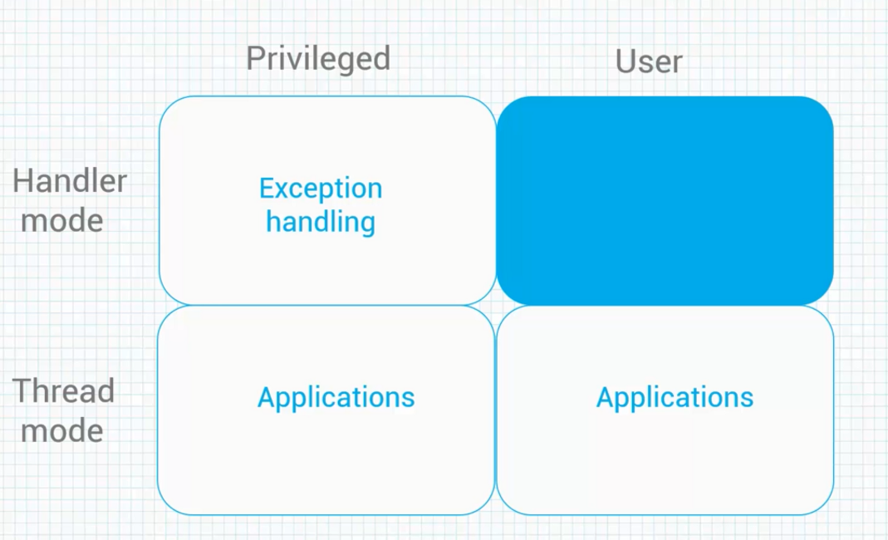
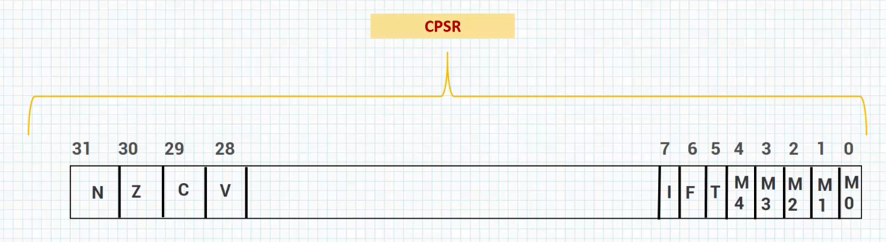
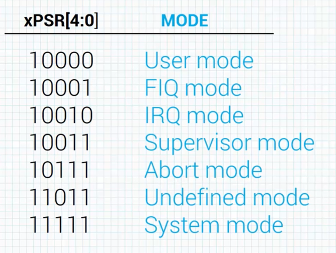
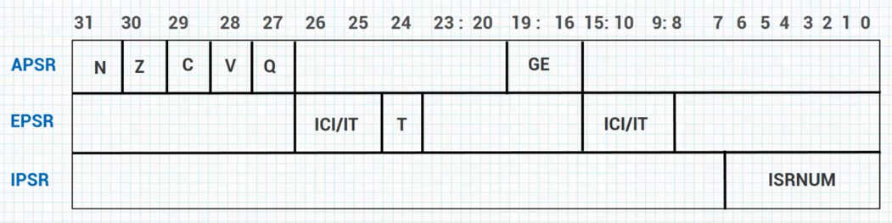

# Data Types

>           Bytes or 8-bit
>           Half Word or 16-bit
>           Word or 32-bit

# Processor Modes

&nbsp;&nbsp;&nbsp;The *Arm 7TDMI Version40* support 7 processor modes: User mode, system mode, the undefined mode, the abort mode, normal interrupt request mode, the fast interrupt request mode and the supervisor mode.

&nbsp;&nbsp;&nbsp;It's possible to make mode changes on the software control but most are normally caused by external conditions like exceptions. Most application programs will execute in `User Mode`, the other modes are known as `Privileged Mode` while the User Mode is the `Unprivileged Mode`, and the `Privileged Modes` are a way to service exceptions or access protected resources such as bits that disable sections of the core like a branch predictor or cache memory. 1 other way of looking at this, ih to few and made as an indication of what the processor is actually doing.  
&nbsp;&nbsp;&nbsp;In normal circumstances, the system will be either in use some mode or `Supervisor Mode`.  
Consider a device like a cellphone where not much happens until ether a signal comes in, while the user has pressed the key onto such a time, the processor probably has powered itself sown and it's using less power and it's probably waiting fo an event to occur before it wakes up to use more power.  
&nbsp;&nbsp;&nbsp;These external events could be seen as interrupt; Typically processors have different number of interrupt but the *ARM 7TDMI* has 2 types:  
The `Fast interrupt` and the `Lower priority interrupt` known as the `Normal interrupt`.  
You can think of `Fast interrupt` as one that might be used to indicate the system is about to lose power in a few milliseconds and the `Normal Interrupt` is one that would be used to indicate the peripheral needs to be serviced or the screen has been touched or the mouse has been moved or ... .  
&nbsp;&nbsp;&nbsp;The `Abort Mode` simply allows to processor to recover from exceptional conditions such as a memory access to one address that doesn't exist physically. This mode can also be uses to support virtual memory systems; Also require for operating systems like *Linux*.  
&nbsp;&nbsp;&nbsp;Processor switched to the `Undefined Mode` when it sees on instruction in the pipeline that it doesn't recognize. It's the responsibility of we, the programmers to determine how the machine should recover from such a error, also for a `Supervisor Mode` we have got dedicated sections just to talk about it and the relation it's got with interrupt and exceptions.

&nbsp;&nbsp;&nbsp;Now let's take a look at the process on most the `ARM CORTEX-M`. The `Cortex-M4` has only 2 nodes. The `Handler Mode` and the `Threat Mode` and there are 2 access levels to go along with these modes that `privileged access level` and the `User access Level`, depending on what the system is doing for every simple applications that purchase on me, only stay in a single access level whereas in situations where you have an embedded operating system control in every thing. Security may play a role by partition into `Kernels` or `Stack memory` from the user stack memory to avoid problems.

# ARM 7TDMI Registers

&nbsp;&nbsp;&nbsp;Registers are just the most fundamental storage area on the chip. You can put almost anything you want on a register, Data values like time of values, counter list tables and so on.  
ARM processor has number of registers inside a processor core and most os these registers are grouped in a unit known as the `Register Bank`.  

**A register is a `Storage` inside the processor core.**  
**ARM processors have a number of registers inside the processor core to preform `Data Processing and control`.**  
**Most of these registers are grouped in a unit called the `Register Bank`.**

> ARM 7TDMI Processor :&nbsp;&nbsp;&nbsp;&nbsp;&nbsp;&nbsp;30 General-purpose registers&nbsp;&nbsp;&nbsp;&nbsp;&nbsp;&nbsp;6 status registers&nbsp;&nbsp;&nbsp;&nbsp;&nbsp;&nbsp;1 program control register

The `general purpose` registers(R0-R12) contain data or addresses.  
R13 is known as the `stack pointer(SP)` and it points to the top element of the stack.  
R14 is known as the `Link Register(LR)` and it's used to store the return location for functions.  
R15 is known as the `Program Counter(PC)`. It's readable and writable.  
The `CPSR` is also known as the `Current Program Status Register` and can be seen as a state of the system; Allowing the program to recover from the exceptions or branch on the result of an operation. It contains `Condition Flags`, `Interrupt Flags`, the `Current Mode` and the `Current state`.  
&nbsp;&nbsp;&nbsp;Each `privileged State` has a saved program status register. Each `Privileged Mode` has its own `SPSR`.  
The `Supervisor` has `SPSR-SVC`.  
`Abort Task` has `SPSR-ABORT`.  
`Undefined` has `SPSR-UNDEF`.  
`Interrupt` has `SPSR-IRQ`.  
`Fast Interrupt` has `SPSR-FIQ`.  
&nbsp;&nbsp;&nbsp;The `SPSR` is used to saved the value of the `CPSR` when an exceptional case since `User Mode` and `System Mode` are not entered on any exception.  
They do not have an `SPSR` and a register to preserve `CPSR`, so it's not require for these modes. Actually in the `User Mode` or `System Mode` if you attempt to read `SPSR` you will get on an unpredictable value back, meaning the data can not be used. And if you attempt to write to the `SPSR Register` in one of these modes,the data will be ignored.

&nbsp;&nbsp;&nbsp;These 4 bits sat the top are collectively known as the `Condition Code Flags` and the 8 bits at the bottom also.  
`Condition Code Flag` can be altered by the `arithmetic and logical instructions` such as subtraction, addition, logical shift, ...  
&nbsp;&nbsp;&nbsp;The `F` and `I` bits are the `Interrupt Disable` bits which disable the fast interrupt in the normal interrupt if they asset.  
`T` bit is known as the `status` bit and it's used to indicate the state of the system.

# ARM 7TDMI Vector Table

The exception of the vector table consist of designed addresses an external memory that hold  necessary information to handle an exception an interrupt or other usual event such as a rest.

# ARM Cortex-M Registers

&nbsp;&nbsp;&nbsp;The Cortex-M family differs from the earlier ARM designs like ARM 7TDMI, but the programmers model are very similar. The processor cores are typically very small for the cortex-M family member; It implement only some of them, some of the cortex-M processors implement only a subset of the ARM instruction set or the TUMB instruction set.  
&nbsp;&nbsp;&nbsp;Cortex-M has fewer physical registers compared to ARM 7TDMI, however the 16 registers used in ARM 7TDMI user mode are the same as the first 16 registers of the cortex-M register bank.

> Cortex-M Processor :&nbsp;&nbsp;&nbsp;&nbsp;&nbsp;&nbsp;17 General-purpose registers&nbsp;&nbsp;&nbsp;&nbsp;&nbsp;&nbsp;1 status registers&nbsp;&nbsp;&nbsp;&nbsp;&nbsp;&nbsp;3 Interrupt mask registers

&nbsp;&nbsp;&nbsp;(R0-R12) are the `general purpose register`, these registers as we discussed earlier can be handle any value you want, they can hold any 32-bit value. In fact, they can hold timer values, variable, is you are designed a filter you can maintain a filter coefficient on them and ... .  
&nbsp;&nbsp;&nbsp;R13 isw known as the `Stack Pointer Register` and is a special function register. The stack pointer register is actually banked as we will see.  
There is a main stack pointer and the process stack pointer. There's the `MSP` and the `PSP`.  
`MSP` is the main stack pointer and `PSP` is the process stack pointer.  
&nbsp;&nbsp;&nbsp;R14 is the `Link Register` and it's also a special function register. It holds the return address of a subroutine or an exception.  
&nbsp;&nbsp;&nbsp;R15 is the `program counter register`. This is the third special function register and it points to the instruction being fetched in the pipeline.  
&nbsp;&nbsp;&nbsp;The `XPSR` register is known as the `program status register` and you can understand why we have an X here in a minute.

&nbsp;&nbsp;&nbsp;The `XPSP`, the `PRIMASK`, the `FAULTMASK`, the `BASEPRI` and the `CONTROL` are special registers. these registers are different from the special function register and because they are special registers, we have to access them using special instructions like `MRS`, which is used to read from a special register and the `MSR` which is used to write to a special register which we should experiment with. 

&nbsp;&nbsp;&nbsp;The `XPSR` preforms the same function as `CPSR` in ARM 7TDMI but with different fields. The entire register can be accessed once or can check it in 3 different ways. The `XPSR` is actually 3 registers:  
They are the `APSR`, the `EPSR` and the `IPSR`.  
&nbsp;&nbsp;&nbsp;The `APSR` simply stands for the `Application Program Status Register`.  
&nbsp;&nbsp;&nbsp;The `EPSR` simply stands for the `Execution Program Status Register`.  
&nbsp;&nbsp;&nbsp;And the `IPSR` simply stands for the `Interrupt Program Status Register`.

***the APSR, the EPSR and the IPSR are just specialized views of the same register***

&nbsp;&nbsp;&nbsp;The `APSR` contains status flags :  `N`, `Z`, `C`, `V`, `greater than or equal flags (GE)` and another flag known as the `Sticky flag (Q)` used in the saturation arithmetic which we should work with.  
&nbsp;&nbsp;&nbsp;The `Sticky` means that bits can be cleared by explicitly writing 0 to this bit.  
&nbsp;&nbsp;&nbsp;`IPSR` contains only 1 exception number that can be used to handle fault and other types of exceptions.  
&nbsp;&nbsp;&nbsp;The `EPSR` contains `IT` also known as `IF/THEN` bit which overlay with interrupt continuity bit `(ICI)`. It also has the bit known as the `T` bit. And this bit stands for the `TUMB` bit.

# ARM Cortex-M Vector Table

&nbsp;&nbsp;&nbsp;The cortex-M vector table is quite different from the ARM 7TDMI vector table. An important point here is that the `LSB bit`(LSB is the least significant bit) should be always set to 1; even if you are coding in C language, the compiler will take care of it for you. When we start looking at the instruction set in the future sections, we will discover that the ARM cortex processors execute the THUMB2 instruction set, rather than the ARM instruction set executed by the ARM 7TDMI.  The cortex-M has about to exceptions; each exception has its own exception number and it addressed in memory.  
&nbsp;&nbsp;&nbsp;So these are the exception list :  

# ARM Data Flow Model

&nbsp;&nbsp;&nbsp;In this lesson, we will look at how data moves between different parts of processor core.  
You as the programmer can think of the ARM core as a functional unit connected by a `data bus` where the arrows represents the flow of data. The line hear represent buses and thd boxes represent either an operation unit or a storage area.  
&nbsp;&nbsp;&nbsp;From this diagram we can see not only the data but also the abstract components that make up the ARM core.  
Data entries the core via the data bus; The data bus can be an instruction to execute or an data item. This arrangement shows a `VON Neumann` implementation of the ARM processor.  
As we can see, the data and instructions share the same bus. The instruction decoder translates the instructions before they are executed. Each instruction executed belong to a particular instruction set.  
&nbsp;&nbsp;&nbsp;Since the ARM processors use the `RISC` architecture and a feature of the RISC architecture is the `Load/Store` architecture, this means it has 2 instruction types for transferring data in and out of the processor.  
`Load instructions` copy data from memory to registers and `store instructions` copy data from registers to memory. There are no data processing instruction that directly manipulate data in memory. Meaning, the data is only processed in the registers, data items are placed in register file and as we mentioned the registers are like 32-bit fast access storage.  
&nbsp;&nbsp;&nbsp;Since the ARM core is 32-bit processor, most instructions treat the register as holding a signed or unsigned 32-bit value. The sign extend hardware, converts 8-bit and 16-bit numbers to 32-bit numbers. As the ARM read from memory and placed in a register. ARM instructions typically have 2 source registers, `Rn` and `Rm` and single result or destination register `Rd`.  
&nbsp;&nbsp;&nbsp;Source operands are read from the register file using internal buses A and B. The arithmetic logic unit known as `ALU` for short ot multiply accumulate unit, known as the `MAC`, takes the register values `Rn` and `Rm` from `A` and `B` buses and calculate a result. The data processing instructions write result in `Rd` directly to the register file. `Load` and `Store` instructions use the `ALU`  to generate an address to be held into the address register and broadcast on the address bus.  
&nbsp;&nbsp;&nbsp;One other important feature of the ARM processor is that register `Rn` can alternatively processed in the `Barrel Shifter` before it enters the `ALU`. Together the `Barrel Shifter` and the `ALU` can calculate a wide range of expressions and addresses. After passing through the functional unit, the register in `Rd` is written back into the register file using the `result bus`.  
&nbsp;&nbsp;&nbsp;For `Load ` and `Store` instructions, the `Incrementor` updates the address register before the core read or write the next register value, from or to the next successive memory location. The processor continues executes instructions until an exception or interrupt changes the normal execution flow.

# The Pipeline

&nbsp;&nbsp;&nbsp;Basically a pipeline is a mechanism a `RISC` processor uses to execute instructions. Using a pipeline massively speed up execution by fetching the next instruction while other instructions are been decoded and executed. One way to view a pipeline is to think of it as a automobile assembly line with each stage carrying out a particularly task to manufacturing vehicle.  
&nbsp;&nbsp;&nbsp;The `Fetch` loads an instruction from memory. the `Decode` identify the instruction to be executed and  the `execute` processes the instruction and write the result back to the register. This is a very simple pipeline :

&nbsp;&nbsp;&nbsp;This is a 3 stage pipeline similar to the one used in the Cortex-M and ARM 7TDMI processors.  
Here is a sequence of 3 instructions, Fetch, Decode and executed by the processor. Each instruction takes a single cycle to complete after the pipeline is full.  
&nbsp;&nbsp;&nbsp;As we can see, the 3 instructions are placed in the pipeline sequentially. In the first cycle the processor Fetches the ADD instruction from memory, In the second cycle the processor Fetches the SUB instruction and Decodes the ADD instruction. In the third cycle, the ADD instruction is executed, thew SUB instruction is Decoded and the compere or CMP instruction is Fetched. This method is called filling the pipeline.

&nbsp;&nbsp;&nbsp;The pipeline in effect allows the core to execute an instruction every cycle. Some implementations of the pipeline architecture used in some cores, like the Cortex-A family, used in devices such as the iphone and other smartphones has as many as 15 stages.  
&nbsp;&nbsp;&nbsp;As the pipeline length increases the amount of work done at each stage is reduced while allows the processor to archive higher operating frequencies. This in turn increase the performance and system latency also increase because it takes more cycle to fill the pipeline before the call can execute an instruction.  
&nbsp;&nbsp;&nbsp;The increased pipeline also means there can be data dependencies between certain stages. We can write code to reduce the dependency using instruction scheduling which we should explore in future sections. The ARM pipeline has no process an instruction until it processes completely thorough the execution stage.  
&nbsp;&nbsp;&nbsp;In the execution stage, the `Program Counter` register always points to the address of the instruction being executes pluse 8 bytes. And it corresponds to the Fetch stage of the pipeline.  
&nbsp;&nbsp;&nbsp;In other worlds, the `PC` always points to the address of the instruction being executed plus 2 instructions ahead. There are 3 properties of the pipeline worth mentioning.  
&nbsp;&nbsp;&nbsp;First the execution of the branch instruction or directly modifying the `PC` cause the ARM core flush the pipeline. Also some ARM architecture like the ARM 10 uses the branch predictor which reduces the effect of the pipeline flush by predicting possible branches and loading the new branch address before the execution of the instructions.  
&nbsp;&nbsp;&nbsp;Finally the instruction and the execution stage will complete even due an interrupt has been raised. Other instructions in the pipeline will be abandoned and processor will start filling the pipeline from the appropriate entry in the vector table.

# ARM Processor Family

# ARM Cortex-A and Cortex-R

&nbsp;&nbsp;&nbsp;The `A` in Cortex-A stands for `Application`. The cortex-A family focuses on high end application such as smartphone, tablets, etc. These are products with very high processing power requirements. The cortex-A core generally have large caches and additional blocks for graphic and operating system support.  
&nbsp;&nbsp;&nbsp;The `R` in the cortex-R stands for `Real-Time`.

# ARM Cortex-M

&nbsp;&nbsp;&nbsp;The `M` in cortex-M stands for the `Micro-Controller` and cortex-M processors are targeted at micro-controllers for every day embedded systems.

> Cortex-M : Cortex-M0 , Cortex-M0+ , Cortex-M1 , Cortex-M3 , Cortex-M4 , Cortex-M7 , Cortex-M23 , Cortex-M33