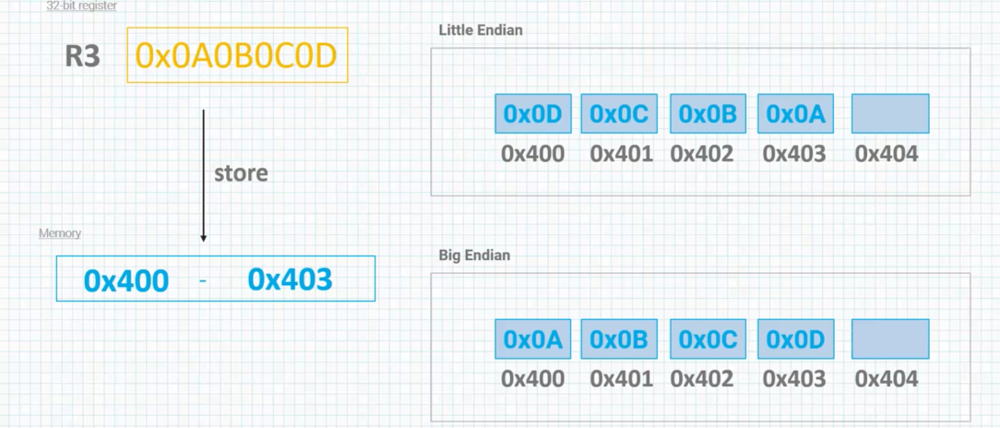

# Frequently used Load/Store Instructions

&nbsp;&nbsp;&nbsp;We said that `RISC` architectures are considered to be load-store architectures, meaning that data in external memory must be brought in to the processor using an instructions. Operations that take a value into memory, multiply by a coefficient, add to another register and then store the result back to the memory with only a single instruction do not exist.

*The load/store instructions both of them have a single format. They both look the same.  

&nbsp;&nbsp;&nbsp;**All** registers can be used for **both Load/Store** instructions. However, when we use R15 which is the `Program Counter` register, we have to know that this is going to change, the flow of the program since the `Program counter` register always holds the address of the next instruction to be executed.  
&nbsp;&nbsp;&nbsp;The addressing modes allow a very flexible as we shall see. But they have two things in common :  
There is a base register and optimal offset.  

  

**Effective address <e<ea>a> :** Final address created from values in various registers with offset.  
Examples :  

# Pre-Indexed Addressing

  
&nbsp;&nbsp;&nbsp;In pre-Index Addressing, address of data transfer is calculated by adding an offset to the value in the Base register(Rn). The optional exclamation sign specifies written effective address back into Rn at the end of instruction. Without the exclamation sign, Rn contains its original value after the instruction execute.  
example :  

# Post-Indexed Addressing  

  

&nbsp;&nbsp;&nbsp;In post-Index Addressing, the effective address of the data transfer is calculated from the unmodified value in the base register(Rn), then the offset is added to the value in Rn and written back to Rn.  

Example :  

# Endianness  
&nbsp;&nbsp;&nbsp;In software engineering there is this concept known as Endianness and this basically deal with how  data is stored in memory. So ARM supports both little Endian and big Endian through software and hardware mechanisms.

  

&nbsp;&nbsp;&nbsp;ARM has no preference for which one we use. It will be ultimately up to the hardware design or to determine how the memory system is configured. The default formate is still `Little Endian` but this can be changed in micro-controller.

# Copying Data from One Memory Location to Another

[code_6](../code_files/6_Copying%20Data%20from%20One%20Memory%20Location%20to%20Another/main.s)