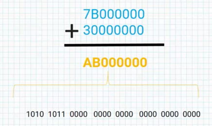
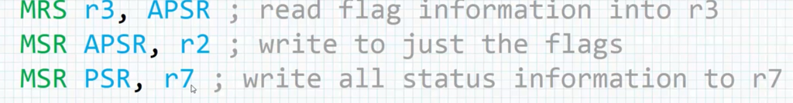
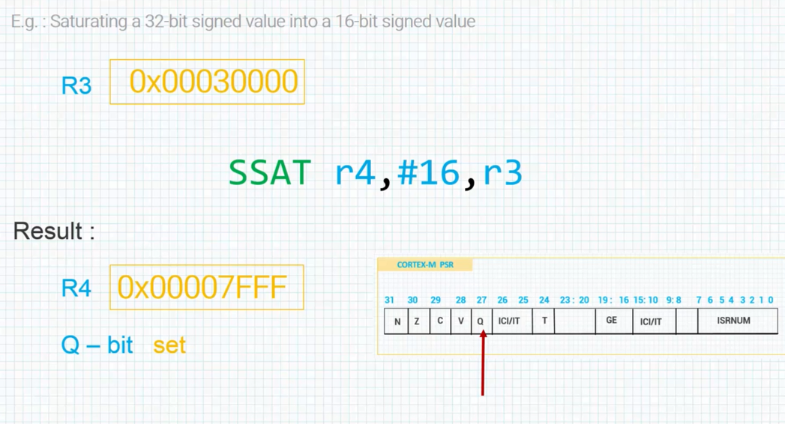
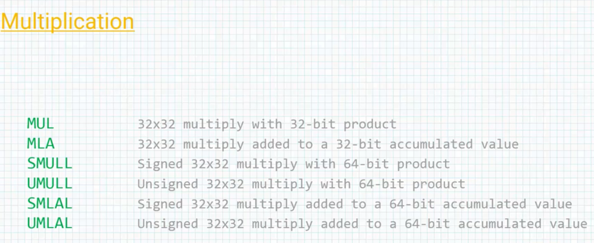
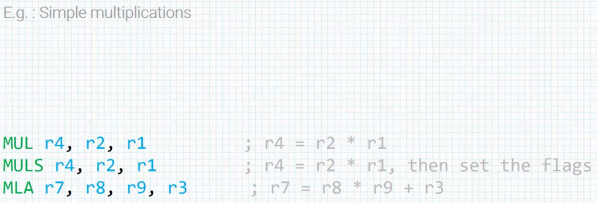
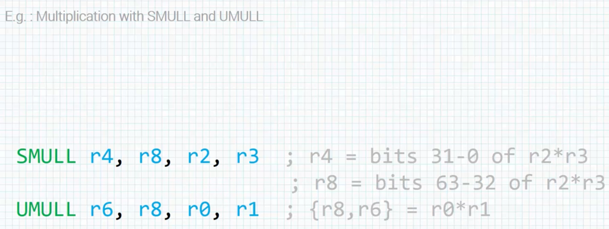
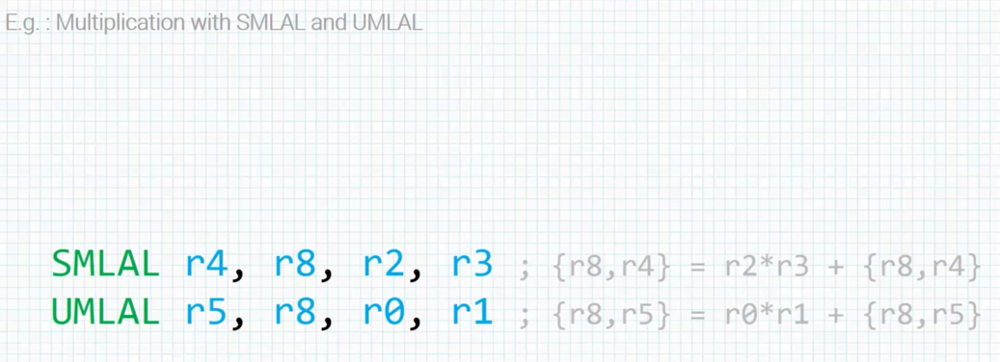

# The N and V Flags

&nbsp;&nbsp;&nbsp;The `N` flag is useful for checking `negative` result. And when we say negative, we mean negative in the context of the 2 complement systems. Remember, in 2 complement, a number is considered to be negative if the `MSB` or the most significant bit is set `high`. If the `MSB` is `one` the number is negative in 2 complement.  
&nbsp;&nbsp;&nbsp;So adding -1 to -2 produces this result and I expand into binary form : 

****And the s in `ADDS` means set N bit in PSR***  
&nbsp;&nbsp;&nbsp;So if we do this and the result is negative, the N bit in PSR register will be set high. If we perform different addition and the result is not negative and we still use ADDS, the N bit is not going to be set high.

&nbsp;&nbsp;&nbsp;If we add this  positive numbers, the result is negative. As we seen in the expand binary arrangement.  

The `MSB` is set to 1. therefore it's negative in the 2 complement systems, although the 2 numbers we add are positive.  
One would think that we should get a larger positive number but that is not the case. We are getting a negative number here. So, something must be wrong. Right?  
&nbsp;&nbsp;&nbsp;First we notice that since the `MSB` is now set, this will force the N bit to set if we use the `ADDS` mnemonic in our instructions.  
Second, if we are not working with 2 complement numbers, then we don't really care what the value of the N bit is.  
Finally, in the 2 complement representation, we notice that we originally intend to a add 2 positive numbers together to get a large positive number, but the result indicates that this positive sum can't be represented in 32 bits. So the result effectively `over flow` the precision we had available. So maybe we need one more flag to work with this sign values.

### The V Flag  

* For indicating a signed overflow  
* Overflow occurs when : Addition, subtraction or compare result is greater that 231 or less than -231  

&nbsp;&nbsp;&nbsp;In this example overflow occurred, if we use `ADDS` mnemonic rather than just a simple `ADD` mnemonic, once this is executed, the `V` bit in the PSR register is going to be set. This is because an overflow occurred and we can read the `V` bit to know that our calculation resulted in an overflow.

# The Z and C Flags 

* Z flag : For checking for `Zero` result :  
The `Z` flag tells us if the result of an operation is zero or not. So after we perform the operation, if the result is zero, the `Z` flag is set, if it not, the `Z` flag is not set.

* C flag : For checking for result greater than 2 32 :  
The `Carry` flag is set, if the result of an addition is greater than or equal to 2 32 or if the result of a subtraction is positive.

# CompareTest Instructions

&nbsp;&nbsp;&nbsp;So, apart from using the `S` bit in instruction to set flags, there are also 4 instructions do nothing except set the condition code or test code for a particularly bit in a register :

>`CMP` _ compare :  
>Subtracts a register or an immediate value from a register value and update the condition codes.

We can use `CMP` to quickly check the content of a register for a particular value; such as : ar the beginning or and of a loop.

>`CMN` _ Compare Negative :  
>Adds a register or an immediate value to another register and update the condition codes.

The `CMN` can also quickly check register content. This instruction is actually the **inverse os CMP** and the assembler will replace a CMP instruction when appropriate.

>`TST` _ Test :  
>Logically ANDs an arithmetic value with a register value and updates the condition codes without affecting the V flag.

We can use `TST` to determine is many bits of register are clear or if at least one bit of a register is set.

>`TEQ` _ Test Equivalence :  
>Logically exclusive ORs an arithmetic value with a register value and updates the condition codes without affecting the V flag.

&nbsp;&nbsp;&nbsp;* Remember we said the condition code flags are kept in the `CPSR` along with the mode and the state os the processor. We can use certain instructions to read ths `CPSR`(in other processor except cortex_M) or the `PSR` in terms of cortex_M processors.  
We can use an instruction set such as `MRS` or `MSR`

>`MRS` : Move the `PSR` to general_purpose register

This just loads a copy of the entire processor state of register into general_purpose register for us.

>`MSR` : Move the general_purpose register to `PSR`  

&nbsp;&nbsp;&nbsp;*We can't use the  register `R15` as an the destination register and we must know, attempt to access to `SPSR` in user mode since the register that's not exist.

Example : 

# Overview of Boolean Operations

&nbsp;&nbsp;&nbsp;ARM supports boolean logic operations using 2 registers operand :  
We saw the `MOV` instructions earlier. Now let's talk about the `MOVN` instruction. The `MOVN` instruction can be used to logically invert all bits in a register since it takes the one's complement negation of an operand.  
&nbsp;&nbsp;&nbsp;So, a very first way to load the two's complement representation of minus one into a register is logically invert the number 0, since the 32 bit value of 0XFFFFFFFF is minus one in two's complement.

&nbsp;&nbsp;&nbsp;* The fifth instruction you may not be familiar with. This is known as a `Bit Clear Operation` and this can be used to clear the selected bits in a register for each bit in the second operand  one clears the corresponding bit in the first operand and a zero leaves unchanged.

# Experimenting with the PSR Flags

[Code_11](../code_files/11_Experimenting%20with%20the%20PSR%20Flags/main.s)

# Experimenting with the Carry Flag

[Code_12](../code_files/12_Experimenting%20with%20the%20Carry%20Flag/main.s)

# Experimenting with the Overflow Bit

[Code_13](../code_files/13_Experimenting%20with%20the%20Overflow%20Bit/main.s)

# Introduction to Shifts and Rotations

&nbsp;&nbsp;&nbsp;This diagram over here shows the internal data path of ARM processor. Where the data for an instruction comes down 2 buses leading to the main ALU or Arithmetic Logic Unit. Only one of those buses go through the Barrel Shifter and the Barrel Shifter is simply dedicated hardware block of logic which is used to rotate or shift data left or right. Because of this asymmetry, we can rotate or shift only one of the operands in the instructions but in the general, this is enough functionality for any code we write with the addition few instructions we can overcome any limitations that introduce to this type of design.  
&nbsp;&nbsp;&nbsp;In fact the very idea to have a Barrel Shifter set between the register bank and the main ALU to allows for 32-bit constants to be used in the ALU and move instructions despite having only 32-bit for the instruction itself.  
On ARM processors there are 2 types of logical shifts, where the data is treated as an unsigned and an arithmetic shift where the data is treated as an assigned. Also there are 2 types of rotate.

# Understanding Logical Shifts

&nbsp;&nbsp;&nbsp;A `Logical Shift Left` by 'n' bits as the same as multiplication by 2n. In a Logical Shift Left by 'n' bits, the bits are shifted left words by the number of bits here is 'n', and the discarded bits are just replaced with zeros.

  

&nbsp;&nbsp;&nbsp;So the `logical shift` works with only `unsigned` data. If we have signed data which is a negative, then we have to use an `Arithmetic Shift`. `Logical Shift` works with just positive numbers, just unsigned numbers.

# Understanding Rotations

  

  

# Experimenting with the Logical Shift Left Instruction

[Code_14](../code_files/14_Experimenting%20with%20the%20Logical%20Shift%20Left%20Instruction/main.s)

# Overview Addition and Subtraction Instructions

  
  
  

# Finding the Maximum Value in a Dataset

[Code_15](../code_files/15_Finding%20the%20Maximum%20Value%20in%20a%20Dataset/main.s)

# Adding Signed Data

[Code_16](../code_files/16_Adding%20Signed%20Data/main.s)

# Finding the Minimum Signed Data

[Code_17](../code_files/17_Finding%20the%20Minimum%20Signed%20Data/main.s)

# Overview of Saturated Math Instructions

&nbsp;&nbsp;&nbsp;Algorithm for handling speech data, adaptive control algorithm and task for filtering are often sensitive to quantization effect when implemented on a microprocessor or a micro controller.  
A careful analysis of both implementation and coefficients used in the filter gives programmers a better idea of caution that must be put in advance. Sometimes it's required that's limitation be placed both on the input data and the algorithms coefficient to prevent overflow conditions or prevent an algorithm from becoming unstable.  
In other case, the software can mitigate any problem by forcing intermediate values to stay within the boundaries,  so they tried to deviate. Saturated math is one os such approach, especially when dealing with signed data.  
&nbsp;&nbsp;&nbsp;The ARM instruction set includes a number os saturated math. Here a few example :

>&nbsp;&nbsp;&nbsp;QADD, QADD8, QADD16, UQADD8, etc

These instruction will return the maximum or minimum values based on the result of the operation. If those values are exceed an additional status bit, the Q-bit we saw earlier indicate that saturation has occurred and this bit is found in the `APSR` register. This bit is known as a `Sticky` bit, meaning once it's set it must be written into a zero to clear it.  
&nbsp;&nbsp;&nbsp;In practice, we might use the saturated operation at the end of the loop or once data has been read as an input to an algorithm to ensure that the values used in further processing are within acceptable limit.

# Overview of Multiplication Instructions

&nbsp;&nbsp;&nbsp;Binary multiplication is provided are nearly every processors these days but it comes at a cost as an operation. It quite common as block of digital hardware, it's quite expensive. In that multiplies usually consumes a bit os area in power relative to other parts of micro-processors. All the micro-processors will often use shift at iterative routine to preform multiplication as for weeding building a large multiplier array. However, these tend to be quite slow.  
&nbsp;&nbsp;&nbsp;Modern design usually perform multiplication in a single cycle or two, but again because os power considerations, if there is a way to avoid using the array, an ARM compiler will try to put this code without multiplying instructions as we shall see later.  
&nbsp;&nbsp;&nbsp;Micro-processors are often selected based on their ability to perform fast multiplication especially areas of speech and signal processing, signal analysis and thing like adaptive control.

  

&nbsp;&nbsp;&nbsp;For multiplication that produced only 32 bits result there is no difference between signed and unsigned multiplication. Only the least significant 32-bt of the result are stored in the destination register and the sign of the operands does no affect this value.   
&nbsp;&nbsp;&nbsp;There is an additional multiply and subtract instruction known as the `MLS` available on the cortex which multiplies to 32-bit values together and then subtract this product from a third value.  
Multiply long instruction produced 64-bit result, they multiply the value of 2 registers and install the 64-bit result in a third and fourth register.

  

# Multiplying by Constants

&nbsp;&nbsp;&nbsp;ٌWhen we spoke about shift and rotate, we saw that the `inline barrel shifter` in the processor data path can be used and conjunction with other instructions such as `ADD` and `SUB` in affect get in multiplication for free. This feature is used to great advantage when certain multiplications are done using the `Barrel shifter` instead of multiplier array.  
&nbsp;&nbsp;&nbsp;Considering the case of multiplying a number by the power of 2, these can be easily be done by using thee logical shift instruction like this : 

>LSL&nbsp;&nbsp;&nbsp;&nbsp;&nbsp;&nbsp; r1 , r0 , #2&nbsp;&nbsp;&nbsp;&nbsp;&nbsp;&nbsp;; r1 = r0 * 4

&nbsp;&nbsp;&nbsp;You might be asked what if we wanted to multiply 2 numbers, one of which is not a power of 2 like the number 5 ?

>ADD&nbsp;&nbsp;&nbsp;&nbsp;&nbsp;&nbsp;r0 , r1 , r1 , LSL #2 &nbsp;&nbsp;&nbsp;&nbsp;&nbsp;&nbsp;; r0 = r1 + r1 * 4

&nbsp;&nbsp;&nbsp;This is the same thing as taking a value, shifting it to the left by 2 bit and when we shift to the left by 2 bit, we get a multiplication by 4 and then adding  the original value to the product. in other words, multiply the number by 5  
Why do this? Recall our discussion about the size and power consumption of a multiplier array. In ultra-low power applications, it’s often necessary to use every trick in the book to save power—like disabling unused logic, powering down caches or the entire processor when idle, reducing voltages and clock frequencies, etc. By using just a 32-bit adder and a barrel shifter, an ARM processor can actually perform multiplications by 2n, 2n ± 1, or even 2n+1 in a single cycle, without needing a dedicated multiplier array. This also saves execution time. For example,

>RSB&nbsp;&nbsp;&nbsp;&nbsp;&nbsp;&nbsp;r0 , r2 , r2 , LSL #3&nbsp;&nbsp;&nbsp;&nbsp;&nbsp;&nbsp;; r0 = r2 * 7

&nbsp;&nbsp;&nbsp;multiplies by 7: shift left by 3 bits (multiply by 8), then subtract the original value. Note the use of reverse subtraction here, as a normal subtraction would produce incorrect results. By combining shifts and adds, larger constants (e.g., 5×7) can be generated.

# Solving a More Complex Equation

 

